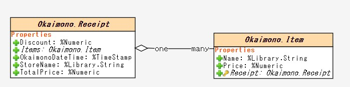
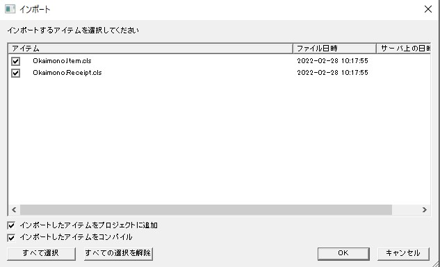
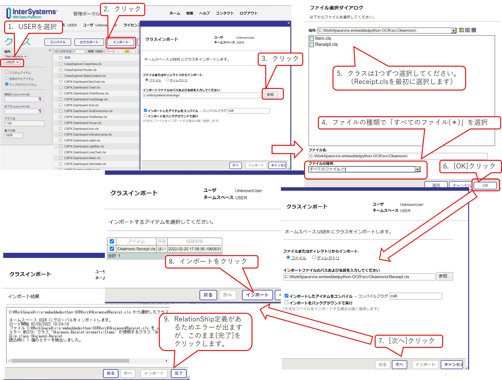
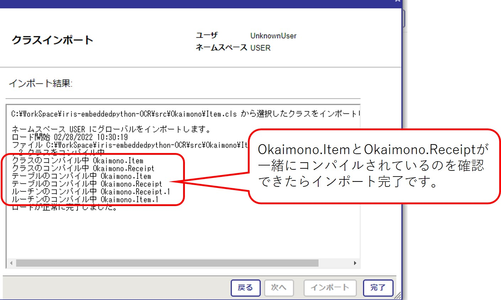

# Embedded Python を使ってお買い物したレシートの内容をIRISに登録してみよう！

このサンプルはインターシステムズ開発者コミュニティの[記事](https://jp.community.intersystems.com/node/513136)のサンプルで、Google の [Vision API](https://www.googleadservices.com/pagead/aclk?sa=L&ai=DChcSEwif8e-V1Zr2AhUPPmAKHdP3CzUYABABGgJ0bQ&ohost=www.google.com&cid=CAESWuD2gmGsRjgHIG7U71M1k1rctWYaB2KNn0LydOekcICKtpptW82vzNRVALKqT08dMmUBmQ_vofF_-t8dGCDfnYt6n-cr4OBBQx2BwGzuBCBQwzTo9FdQEthiLQ&sig=AOD64_0fAWgO8HeN47Wyzd0-cCqGNNhevg&q&adurl&ved=2ahUKEwie_eeV1Zr2AhWQk1YBHS0DBPMQ0Qx6BAgCEAE) を利用してレシートのJPG画像から購入物品をテキストで抽出し、Embedded Python を使用してIRISにデータを登録する流れを確認できます。


**参考にしたページ：[【Google Colab】Vision APIで『レシートOCR』](https://qiita.com/shoku-pan/items/bf5645894803769edc72)**

**注意：オーケーストアの食品情報のみを登録するサンプルにしています。他店のレシートに合わせて加工していません。ご了承ください**

IRISには2つのクラスを用意しています。


- 1側クラス：Okaimono.Receipt
    
    レシートの基本情報を格納します。（店名、買い物時間、購入合計、割引金額など）

- 多側クラス：Okaimono.Item

    レシートに記載された詳細項目の項目名と金額を格納します。

## 事前準備

Googls の Vision API を使用しています。
事前にサービスを有効にし、サービスアカウントキーを入手し、取得したJSONファイルを[/okaimono_python](/okaimono_python) に配置し、[receipt.py](./okaimono_python/receipt.py)の2行目に取得したJSONのフルパスを指定してください。

```
例）
json_path="/okaimono_python/ocrproject-00001-abshak102qq1.json"
```

サービスを有効化できない場合は、予めOCRで切り出したテキストファイル [/okaimono_python/data/*.txt](/okaimono_python/data)を使用してIRISへ登録する流れだけ試すこともできます。

詳細は後方の [実行方法](#実行方法) をご参照ください。

コンテナを利用しない場合（例：WindowsにインストールしているIRISで動かしたい場合など）は、[コンテナ以外での実行方法](#コンテナ以外での実行方法) をご参照ください。


## コンテナ開始・停止・破棄の手順

1) git clone

    ```
    git clone https://github.com/iijimam/iris-embeddedpython-OCR
    ```

2) cloneしたディレクトリに移動

    ```
    cd iris-embeddedpython-OCR
    ```

3) コンテナ開始の為、[start.sh](./start.sh) を実行

    *Linux環境のみで実行*
    ```
    $ ./start.sh
    ```

4) コンテナビルドと開始

    ```
    docker-compose up -d --build
    ```
        
    - ビルド済でコンテナを破棄した後は以下の方法で開始
        
        ```
        docker-compose up -d
        ```
        stop でコンテナを停止した後は以下の方法で開始
        ```
        docker-compose start
        ```

5) コンテナ停止
    
    ```
    docker-compose stop
    ```
6) コンテナ破棄

    ```
    docker-compose down
    ```

## 実行方法

1) コンテナにログインします。

    ```
    docker exec -it embeddedpython bash
    ```

2) IRISにログインします。

    ```
    iris session iris
    ```

3) Pythonのシェルに切り替えます。

    ```
    do ##class(%SYS.Python).Shell()
    ```

4) sysモジュールをインポートして pyファイルがあるディレクトリを追加します。

    ```
    import sys
    sys.path+=['/okaimono_python']
    ```

**Vision APIの有効にされた方は 5 を、IRISへデータ登録する流れのみを試す方場合は 6 をご覧ください**

5) Vision API を有効にされた場合

    receipt.pyをインポートし、jpgファイルを指定して実行します。

    ```
    import receipt
    file="/okaimono_python/data/OK1.jpg"
    receipt.getOCRData(file)
    ```

6) Vision API を使用せず、IRISへの登録を確認される場合

    receiptIRIS.pyをインポートし、OCRで切り出された文字列が入ったテキストファイルを指定して実行します。

    ```
    import receiptIRIS
    file="/okaimono_python/data/OK1.txt"
    receiptIRIS.savefromfile(file)
    ```

7) データ確認

    Pythonのシェルで確認する場合

    ```
    import iris
    rs=iris.sql.exec("select Receipt->StoreName,Receipt->TotalPrice,Receipt->Discount,Name,Price from Okaimono.Item")
    for idx,row in enumerate(rs):
        print(f"[{idx}]:{row}")
    ```

    管理ポータル > SQL を開き、USERネームスペースに移動した後、Okaimono.Receipt または Okaimono.Item のデータをご確認ください。

    http://127.0.0.1:52775/csp/sys/exp/%25CSP.UI.Portal.SQL.Home.zen?$NAMESPACE=USER


8) 終了手順

    Pythonシェルを終了します。
    ```
    quit()
    ```

    IRISのターミナルを終了します。

    ```
    halt
    ```
    コンテナログインを終了します。
    ```
    exit
    ```

## コンテナ以外での実行方法

以下、WindowsにEmbedded Pythonが利用できるIRISをインストールした場合の実行方法をご紹介します。

Embedded Python は IRIS2021.2 以降でご利用いただけます。ダウンロードは[こちらから](https://evaluation.intersystems.com/Eval/index.html)。

___
**★注意★**

**以下の内容は、IRIS2021.2 で確認した内容で記載しています。2021.2では、IRIS のインストールディレクトリ以下にインストールした Python3.9 を Embedded Python で使用しています（Windows 以外では、OS にインストールされた Python を使用します）。将来のバージョンでは、他 OS と同様に OS にインストールされた Python を利用するように変更される予定です。**
___

サンプルは、Google の Vision API を使用しいるため、事前にサービスアカウントキーを入手する必要があります。キー入手後の指定については、[事前準備](#事前準備)をご参照ください。

1) google-cloud-vision モジュールのインストール

    irispip を利用して **＜IRISインストールディレクトリ＞\mgr\python** をターゲットに指定してインストールします。

    以下の例では、IRISインストールディレクトを **c:\intersystems\irisx** と仮定して記述しています。
    ```
    >cd c:\intersystems\irisx\bin
    
    >irispip install --target C:\InterSystems\irisx\mgr\python google-cloud-vision
    ```

2) サンプルのダウンロード

    git clone または Zip でサンプルをダウンロードした後、以下2つのクラス定義をIRISにインポートします。

    - [Receipt.cls](src/Okaimono/Receipt.cls)
    - [Item.cls](src/Okaimono/Item.cls)

    インポートはスタジオか管理ポータルから行えます。
    
    - スタジオの場合
    
        スタジオを開き、USERネームスペースに接続します（スタジオメニューバーのファイル > ネームスペース変更でUSERを選択）。[Receipt.cls](src/Okaimono/Receipt.cls) と [Item.cls](src/Okaimono/Item.cls) を**2つまとめて選択**し、スタジオのエリアにドラッグ＆ドロップします。

        表示される子画面のOKボタンをクリックしたらインポート完了です。
        
        

        

    - 管理ポータルの場合

        管理ポータルのインポートツールでは、複数ファイルを一括選択できないため、**1つずつ**インポートします。
    
        管理ポータルを開きます。（http://localhost:52773/csp/sys/UtilHome.csp）

        ホーム > システムエクスプローラ > クラス > 画面左で「USER」ネームスペースを選択し「インポート」ボタンをクリックします。

        最初に [Receipt.cls](src/Okaimono/Receipt.cls) をインポートします。
        （インポート時、「ファイルの種類」を **「すべてのファイル(*)」** に変更すると拡張子 cls のファイルを選択できます。）

        

        Receipt.cls インポート時、Item.cls との間の RelationShip 定義により、インポート時にコンパイルエラーが発生しますが、Item.cls インポート時に一緒にコンパイルされるため無視してください。

        Receipt.cls のインポートが完了したら、[Item.cls](src/Okaimono/Item.cls) をインポートします。

        Item.clsのインポート結果を確認し、以下のように表示されていたらインポート完了です。
        
        

3) Pythonの実行

    以下の例では、**C:\WorkSpace\iris-embeddedpython-OCR** に git clone 後のディレクトリがあると仮定して記述しています。

    実行には、[Receipt.py](okaimono_python/receipt.py)を利用します。

    1) IRISのターミナルを開きます。

    2) Pythonシェルを起動します。

        ```
        do ##class(%SYS.Python).Shell()
        ```

    3) sysモジュールをインポートし、pyファイルのあるディレクトリのパスを追加します。

        例では **C:\WorkSpace\iris-embeddedpython-OCR\okaimono_python** を追加しています。

        ```
        import sys
        sys.path+=['C:\WorkSpace\iris-embeddedpython-OCR\okaimono_python']
        import receipt
        file='C:\WorkSpace\iris-embeddedpython-OCR\okaimono_python\data\OK1.jpg'
        receipt.getOCRData(file)
        ```

    4) データ確認

        Pythonのシェルで確認する場合

        ```
        import iris
        rs=iris.sql.exec("select Receipt->StoreName,Receipt->TotalPrice,Receipt->Discount,Name,Price from Okaimono.Item")
        for idx,row in enumerate(rs):
            print(f"[{idx}]:{row}")
        ```

        管理ポータル > SQL を開き、USERネームスペースに移動した後、Okaimono.Receipt または Okaimono.Item のデータをご確認ください。

        http://127.0.0.1:52775/csp/sys/exp/%25CSP.UI.Portal.SQL.Home.zen?$NAMESPACE=USER
    
    5) Pythonシェルの終了
        ```
        quit()
        ```
    
    6) IRISのターミナル終了
        ```
        halt
        ```